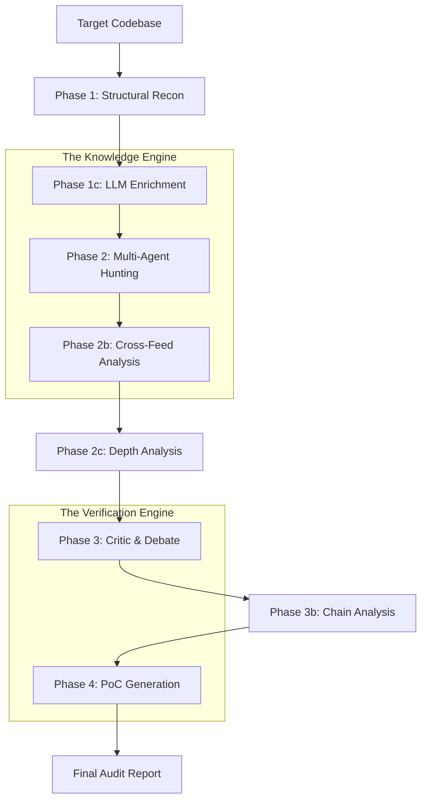

# Avadhi: Detailed System Architecture & Pipeline

Avadhi is an autonomous multi-agent system designed to bridge the gap between static analysis and human-level security research. This document outlines the end-to-step execution flow of the pipeline.

---

## 🛰️ High-Level Pipeline Flow

---

## 🪜 Phase-by-Phase Execution

### Phase 1: Structural Recon (The Foundation)
*   **Input**: A local directory path containing Solidity contracts.
*   **Process**:
    1.  **File Discovery**: Scans for all `.sol` files, respecting `.gitignore` and `scope.txt` if provided.
    2.  **Parsing**: Uses `slither` (if installed) or a custom tree-sitter parser to extract the Abstract Syntax Tree (AST).
    3.  **Graph Construction**: Builds the `SecurityGraph` (a directed graph using NetworkX).
        *   **Nodes**: Contracts, Functions, State Variables, Events.
        *   **Edges**: `CALLS`, `WRITES` (state mutations), `READS`, `INHERITS`.
*   **Result**: A machine-readable map of the entire protocol's logic.

### Phase 1c: LLM Enrichment (Semantic Context)
*   **Process**: The system feeds the top-level graph structure to a high-reasoning LLM (Claude 3.5 Sonnet).
*   **Action**: The LLM identifies:
    *   **Protocol Purpose**: (e.g., "This is a cross-chain liquidity aggregator").
    *   **Trust Boundaries**: Who is the Owner? What are the specialized Roles?
    *   **High-Level Invariants**: "User balances must always equal total deposits minus withdrawals."
*   **Result**: The `SecurityGraph` is decorated with semantic "hints" that guide the hunters.

### Phase 2: Multi-Agent Hunting (The Search)
*   **Process**: Parallel execution of 18+ specialized "Hunter Agents".
*   **Hunter Examples**:
    *   `AccessControlHunter`: Searches for missing modifiers or logical bypasses in `onlyOwner` patterns.
    *   `ERC20SafetyHunter`: Detects non-standard token risks (USDT `approve` behavior, etc.).
    *   `OracleHunter`: Looks for price manipulation and staleness check omissions.
    *   `DefiMathHunter`: Finds rounding errors, overflows, and slippage issues.
*   **Result**: A collection of raw **Hypotheses** (potential vulnerabilities).

### Phase 2b & 2c: Cross-Feed & Depth Analysis
*   **Cross-Feed**: Agents share their findings. If a math error is found in Contract A, the Access Control hunter re-scans Contract B to see if that error can trigger a permission bypass.
*   **Depth Analysis**: High-severity findings are handed to "Depth Agents" who perform targeted RAG (Retrieval-Augmented Generation) against a database of past exploits to see if this specific pattern matches known hacks.

### Phase 3: Critic & Debate (Verification)
*   **Process**: To eliminate false positives, every hypothesis is sent to a **Critic LLM**.
*   **Action**: The Critic acts as a "Senior Auditor" and attempts to "break" the finding by pointing out:
    *   Solidity version-specific safety features.
    *   Protocol constraints identified in Phase 1c.
    *   Logical impossibilities in the attack vector.
*   **Result**: Hypotheses are marked as `CONFIRMED`, `CONTESTED`, or `REFUTED`.

### Phase 4: PoC Generation (The Evidence)
*   **Process**: For every `CONFIRMED` High/Critical finding, the PoC Agent is invoked.
*   **Action**:
    1.  Analyzes the attack path.
    2.  Writes a standalone Solidity test file (Foundry `test` or Hardhat `it`).
    3.  Uses the source code snippets to mock the environment and simulate the exploit.
*   **Result**: Runnable proof-of-concept code.

### Final Step: Report Assembly
*   **Process**: The system compiles the surviving hypotheses, their debate logs, and the generated PoCs into a Markdown report.
*   **Output**: `hunt_results.md` (ready for Immunefi or Code4rena submission).

---

## ⚙️ Technical Stack
- **Language**: Python 3.9+
- **Graph Engine**: NetworkX
- **LLM Orchestration**: LangChain / Custom Agent Framework
- **Primary LLM**: Claude 3.5 Sonnet (Thinking)
- **Secondary LLM**: GPT-4o
- **Static Analysis**: Slither
